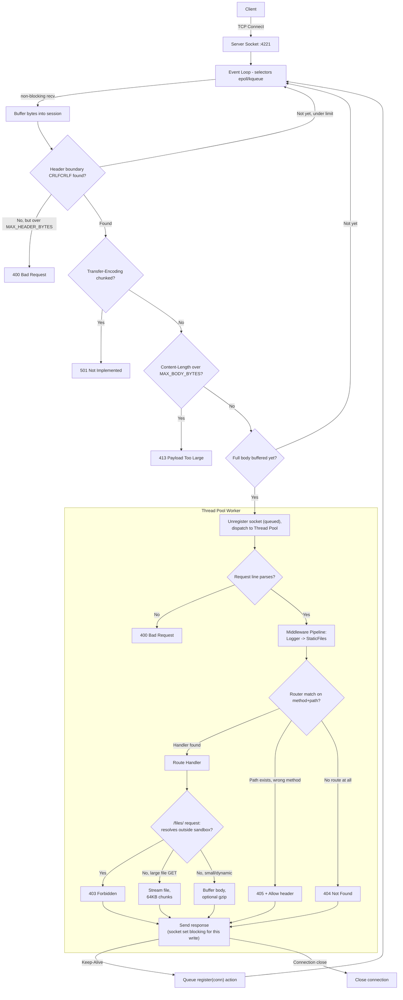
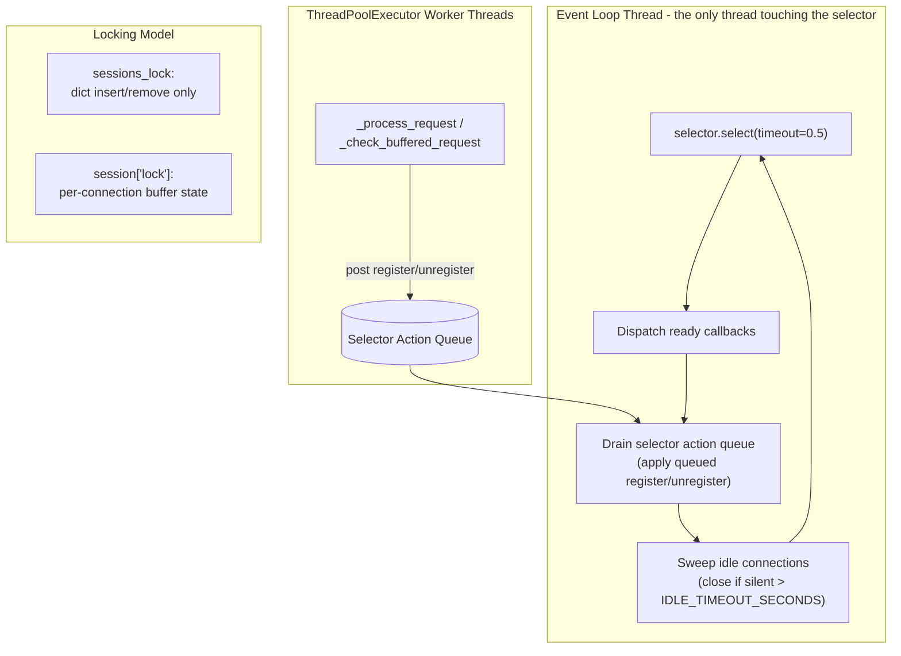

# Custom Python HTTP Server & Web Framework

[](https://github.com/kankaniakshat185/custom-http-server/actions/workflows/tests.yml)

A modular, high-performance HTTP/1.1 server and lightweight framework built from scratch in Python. It uses an event-driven networking architecture with non-blocking I/O (`selectors`), a task-dispatching worker thread pool, Express-style middleware, dynamic path variable routing, and persistent HTTP/1.1 connections - hardened with request-size limits, idle-connection timeouts, and a single-writer selector model, and backed by a 33-test pytest suite running in CI.

Full write-up of the architecture and the concurrency bugs a self-audit found: [Behind the Sockets: What I Learned Building a Python HTTP Server](https://akshatkankani.vercel.app/tech-blog/custom-http-server)

---

## Core Features

### Networking & Concurrency
* **Async Event Loop**: Event-driven network loop using I/O multiplexing (`selectors` wrapping `epoll`/`kqueue`) for non-blocking socket polling.
* **ThreadPool Offloading**: Pre-allocated thread pool (`ThreadPoolExecutor`) to process routing handlers and file I/O tasks, keeping the event loop responsive.
* **Single-Writer Selector Model**: Worker threads never call `selector.register()`/`unregister()` directly - `selectors.DefaultSelector` isn't safe to mutate concurrently with an in-progress `select()` call. Instead, they post a `("register"|"unregister", conn)` action onto a queue, and only the event-loop thread drains it and touches the selector.
* **Per-Connection Locking**: Each connection's buffer/parse state is guarded by its own `threading.Lock()`, so two unrelated clients never contend with each other. A separate, coarse `sessions_lock` only guards structural inserts/removals from the connection table.
* **Fault-Isolated Event Loop**: Every callback dispatched from the event loop (`_accept`, `_read`) is wrapped so one misbehaving connection (a bad `accept()`, a socket error) can never crash the whole server.
* **Keep-Alive & Pipelining**: Persistent HTTP/1.1 connections, with support for multiple pipelined requests arriving in a single TCP read.

### HTTP Protocol Handling
* **Onion Middleware**: A recursive middleware chain pipeline (`request, next_handler`) resembling Express/Koa architecture.
* **Parametric Routing**: Dynamic path parameter parsing and pattern matching (e.g., `/echo/:string`).
* **405 vs 404 Correctness**: A path that exists under a different HTTP method returns `405 Method Not Allowed` with a populated `Allow` header, instead of collapsing into a generic `404`.
* **GZIP Compression**: Automated runtime payload compression based on client request headers, skipped automatically for already-compressed content-types (images, video, audio, zip, PDF) where recompressing would just burn CPU.
* **Streamed Large File Responses**: Static files above 1MB are read and written in 64KB chunks (`HTTPResponse.stream_path`) instead of being buffered fully in memory; smaller files are still buffered (and gzip-eligible) for simplicity.
* **MIME Resolution**: Automated header detection using the standard system mime database.

### Security & Resilience
* **Directory Traversal Defense**: Canonical path validation (`os.path.realpath`) blocking file access outside the sandbox folder - checked against a full path-separator boundary, not a bare string prefix, so a sibling directory (e.g. `data-evil` next to `data`) can't slip through.
* **Required Sandbox Directory**: `--directory` must be passed explicitly; the server refuses to start rather than silently falling back to serving the current working directory.
* **Request Size Limits**: Headers over 16KB or a declared `Content-Length` over 10MB are rejected (`400`/`413`) before being buffered, bounding memory use against a single oversized request.
* **Idle Connection Timeout**: Any connection - stalled mid-request or sitting idle between keep-alive requests - is closed after 30 seconds of silence, the read-timeout mitigation for slow-drip (Slowloris-style) clients.
* **Chunked Transfer-Encoding Rejection**: `Transfer-Encoding: chunked` requests get an explicit `501 Not Implemented` rather than being silently mis-parsed (which would previously desync the next pipelined request off unread chunk data).

### Observability & Testing
* **Structured Logging**: Access logs and crash traces go through the standard `logging` module (timestamps, levels, logger names) instead of raw `print()`; clients only ever see a generic `500` body, never internal exception details.
* **Test Suite**: 33 pytest tests covering routing, request/response parsing, static-file traversal (including a regression test for the prefix-bypass bug), and real-socket integration tests for the shutdown deadlock, size limits, and status-code correctness.
* **Continuous Integration**: GitHub Actions runs the full suite on every push and pull request (`.github/workflows/tests.yml`).

### Performance Highlights
* **~1,200 requests/sec** throughput.
* **~17% higher throughput** than Flask under this raw benchmarking workload.
* **~14.5% lower** average latency.
* **~33% lower** tail latency.

> These RPS-vs-Flask numbers were captured before the hardening pass above and
> haven't been re-run. See "Concurrency Benchmarks: Before vs. After the Fixes"
> below for numbers that were actually re-measured against both versions.

---

## Architecture

### Request Lifecycle



### Selector & Lock Ownership



### Concurrency Design
* **Event Loop Thread**: Monitors active connections, reads incoming bytes into per-connection session buffers, and detects request boundaries (`\r\n\r\n` + `Content-Length`). It is the *only* thread that ever calls `selector.register()`/`unregister()`/`select()`.
* **Selector Action Queue**: Worker threads that need to change a socket's read-interest (re-registering after a keep-alive response, unregistering before dispatch) post an action to a `queue.Queue` instead of touching the selector themselves; the event-loop thread drains it once per tick, right after processing events and before the next `select()` call.
* **Per-Connection Locking**: Buffer/parse state lives inside each connection's session dict, guarded by that session's own lock - so two different clients' requests are never serialized behind one global mutex. A separate `sessions_lock` only protects inserting/removing entries from the connection table itself.
* **Idle Sweep**: Once per event-loop tick, any connection silent for longer than `IDLE_TIMEOUT_SECONDS` (default 30s) is closed - covers both a stalled mid-request client and a keep-alive connection nobody's using anymore.
* **Connection Re-registration**: After writing the response, the worker thread checks the keep-alive status. If persistent, it queues a re-registration action instead of registering directly.
* **Blocking-for-the-Write**: `conn` is normally non-blocking (owned by the event loop), but a worker thread temporarily flips it to blocking for the duration of sending a response - large/streamed bodies sent across many `sendall()` calls can otherwise overflow the OS send buffer and raise `BlockingIOError` mid-response instead of waiting.

---

## Design Goals

* **Modular Architecture**: Restructured from a monolith into clean, single-responsibility modules.
* **Separation of Concerns**: Disconnected request/response formatting, router matching, and socket loop layers.
* **Extensible Middleware**: Clean interfaces allowing third-party extensions to wrap route execution.
* **Thread Safety**: Per-connection state and all selector mutation are synchronized through a single-writer model rather than one global lock, so unrelated connections don't contend with each other.
* **Resilience**: A single bad connection, oversized request, or unsupported encoding degrades to a clean error response, not a crashed server or a hung shutdown.
* **Verifiability**: Every fix above shipped with a regression test - including one that starts a real server on a real socket to prove `stop()` no longer deadlocks.

---

## Directory Structure

```
custom-http-server/
 ├── .github/
 │    └── workflows/
 │         └── tests.yml        # CI: runs pytest on push/PR
 ├── app/
 │    ├── core/
 │    │    ├── request.py       # HTTPRequest parsing
 │    │    ├── response.py      # HTTPResponse serialization & streaming
 │    │    └── server.py        # Selector loop, ThreadPool, and concurrency safety
 │    ├── middleware/
 │    │    ├── base.py          # Middleware pipeline engine
 │    │    ├── logger.py        # Structured access/crash logging
 │    │    └── static.py        # Static file actions & path defenses
 │    ├── routing/
 │    │    └── router.py        # Path parameter match routing + 405 support
 │    └── main.py                # Framework setup and routes register
 ├── tests/                      # pytest suite (unit + real-socket integration)
 ├── pytest.ini
 ├── Dockerfile
 └── Docker-compose.yaml
```

> `docs/` and `FEATURES.md` are local, gitignored notes (interview prep, architecture
> scratch notes) and are not part of this repo's tracked contents.

---

## How to Run

### Local Execution
Specify the target sandbox directory and launch with `PYTHONPATH`:
```bash
mkdir -p sandbox
PYTHONPATH=. python3 app/main.py --directory ./sandbox
```

### Docker Execution
Or start the containerized service:
```bash
docker-compose up --build
```

### Running Tests
```bash
python3 -m pytest -v
```

---

## Framework Usage Example

To write applications using this project as a framework:

```python
from app.core.server import HTTPServer
from app.core.response import HTTPResponse

server = HTTPServer(host="0.0.0.0", port=4221, max_workers=10)

# Register custom middleware
def custom_middleware(request, next_handler):
    print(f"Request intercepted: {request.path}")
    return next_handler(request)

server.pipeline.use(custom_middleware)

# Register route
def hello_handler(request):
    name = request.path_params.get("name", "World")
    return HTTPResponse(status=200, body=f"Hello, {name}!".encode("utf-8"))

server.router.add_route("GET", "/hello/:name", hello_handler)

server.start()
```

---

## Benchmarking Guide

You can compare this server against a standard Flask setup using Apache Bench (`ab`):

```bash
# 1. Start our server on port 4221, and Flask on port 8080
# 2. Run ab load-test (10,000 requests, 100 concurrency)
ab -n 10000 -c 100 http://localhost:4221/
ab -n 10000 -c 100 http://localhost:8080/
```

---

## Performance & Benchmarks

The following metrics were gathered locally on a MacBook Air:

| Metric | Custom HTTP Server (Our Framework) | Python Flask (Werkzeug) | Comparison |
| :--- | :--- | :--- | :--- |
| **Requests per Second (RPS)** | **1,197.62 rps** | 1,023.22 rps | **Custom Server is ~17% Faster** |
| **Total Time Taken** | **8.350 seconds** | 9.773 seconds | **Custom Server completes ~14.5% faster** |
| **Average Latency (mean)** | **83.499 ms** | 97.731 ms | **Custom Server has ~14.5% lower latency** |
| **Max Tail Latency (100%)** | **293 ms** | 442 ms | **Custom Server has ~33% lower tail latency** |

### Benchmark Specifications
- **Hardware**: MacBook Air M2 (8-core CPU, 16 GB RAM)
- **Parameters**: `ab -n 10000 -c 100` targeting `/` route
- **Software**: Python 3.13.5, Flask 3.1.3, Werkzeug 3.1.8

### Performance Analysis
* **Network Multiplexing**: The single-threaded `selectors` loop monitors client sockets via kernel-level event descriptors. Idle sockets consume no CPU context-switching overhead.
* **Worker Execution Queue**: Thread allocation costs are paid upfront during startup. Socket workloads are dispatched as task pointers to the thread pool, preventing thread-per-connection scaling failures.
* **Low Overhead Routing**: We omit heavy routing engines, application context loaders, and request/response abstraction layers found in general-purpose frameworks like Flask.

*Note: Flask is a feature-rich, general-purpose framework. This benchmark measures a raw throughput workload under a specific concurrency level; the results demonstrate the efficiency of our low-level hybrid networking model rather than suggesting this server is broadly "better" than Flask.*

---

## Concurrency Benchmarks: Before vs. After the Fixes

The RPS-vs-Flask table above is a single-connection serial `ab` run against `/` -
it wouldn't have caught the shutdown deadlock or the selector race, because
neither bug depends on raw throughput, they depend on *concurrent open
connections*. So instead of re-running `ab`, the concurrency fixes were
benchmarked directly: the exact pre-audit `server.py` (reconstructed from the
original commit) was run side-by-side against the current one, hitting both
with real sockets - not mocks - at several concurrency levels.

### Shutdown latency

Each row opens N real Keep-Alive connections, then triggers shutdown and
measures how long it takes to complete (capped at a 3s timeout to detect a hang):

| Open connections at shutdown | Before | After |
| :--- | :--- | :--- |
| 0 | completes, 0.49s | completes, 0.49s |
| 1 | **hangs (3.00s timeout)** | completes, 0.50s |
| 10 | **hangs (3.00s timeout)** | completes, 0.50s |
| 50 | **hangs (3.00s timeout)** | completes, &lt;0.5s |

The old code hung on every single run with at least one open connection - not
occasionally, every time, which is exactly what you'd expect from a
reentrant-lock bug rather than a timing-dependent race.

### Throughput under real concurrent Keep-Alive load

N client threads, each holding one persistent connection and firing `GET /`
back-to-back for a fixed 2-second window, aggregate requests/sec across all of them:

| Concurrent clients | Before | After |
| :--- | :--- | :--- |
| 1 | 21,759 rps | 12,141 rps |
| 10 | 17,823 rps | 11,565 rps |
| 50 | 17,941 rps | 14,188 rps |

Worth being honest about: the fixed version is slower here, consistently.
That's the real cost of the added per-request work (header/body size checks,
chunked-encoding detection, idle-timeout bookkeeping, a per-connection lock
acquisition) that the original version simply didn't do. None of it is
optional if the size-limit and traversal fixes above are supposed to mean
anything - but it isn't free, and pretending otherwise would defeat the point
of actually measuring this.

That table is also not the full story. Running it once already caught a real
bug: at 1 concurrent client, the *first* fixed version - before the paragraph
below - measured **2.5 rps**, not 12,141. Every request after the first one
was taking a flat ~500ms. The selector-action-queue fix (bug two, in the
[full write-up](https://akshatkankani.vercel.app/tech-blog/custom-http-server))
is correct for the race condition, but a queued re-registration was sitting
unapplied until the event loop's *next scheduled* `select()` wakeup - fine
under load, since something else keeps waking the loop constantly, but with
one low-frequency client there was often nothing else to trigger an early
wakeup, so every request paid up to the full 0.5s poll timeout. The fix is a
`socket.socketpair()` the event loop also watches: a worker thread queuing an
action now writes one byte to it, which immediately unblocks a sleeping
`select()` instead of waiting for it to time out. The 12,141 rps number above
is with that fix in place - benchmarking the fix caught a regression the fix
itself introduced, which is a large part of why this table exists at all
instead of just an assertion that things got better.

*Methodology: both variants run in-process via `threading.Thread`, driven by
real `socket.create_connection` clients on `127.0.0.1` - no mocks, no `ab`.
Numbers are from a single run each on the same machine as the RPS table above;
treat them as directionally accurate, not lab-grade reproducible benchmarks.*

---

## Testing Endpoints

```bash
# 1. Root
curl -v http://localhost:4221/

# 2. Echo with compression
curl -v http://localhost:4221/echo/hello_world --compressed

# 3. User-Agent
curl -v http://localhost:4221/user-agent -H "User-Agent: my-custom-agent"

# 4. File uploads/downloads
curl -v -X POST http://localhost:4221/files/hello.txt -d "Written through custom server"
curl -v http://localhost:4221/files/hello.txt
curl -v -X DELETE http://localhost:4221/files/hello.txt

# 5. Directory Traversal test (expect 403)
curl -v --path-as-is http://localhost:4221/files/../../../../etc/passwd

# 6. Wrong method on a registered path (expect 405 + Allow header)
curl -v -X POST http://localhost:4221/echo/hi

# 7. Chunked request body (expect 501, not a silently corrupted pipeline)
curl -v -X POST http://localhost:4221/files/x -H "Transfer-Encoding: chunked" -d "streamed"

# 8. Oversized request body (expect 413)
curl -v -X POST http://localhost:4221/files/x -H "Content-Length: 999999999999"
```

---

## License

This project is licensed under the MIT License - see the [LICENSE](LICENSE) file for details.
